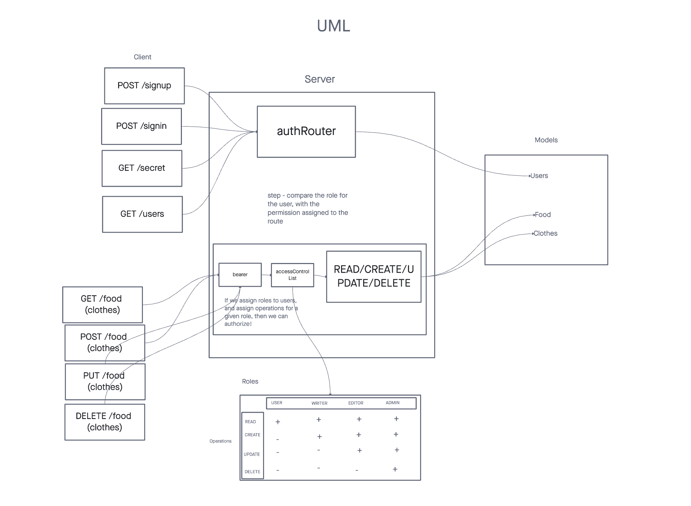

# auth-api

This is an Express server that implements Basic Authentication and Bearer Token Authentication, using a Postgres database for storage and extends the restrictive capabilities of our routes to the API.

## Installation

* `npm install`

Set your PORT and Database environment with an .env file

```text
PORT=3001
DATABASE_URL=postgres://localhost:5434/database_name
SECRET=secret_name
```

## Usage

### Authentication System (Phase 2)

## Create User (POST)

- **Route**: `/signup`
- **Method**: POST
- **Description**: Create a new user.
- **Request Body**:
  - `username` (String)
  - `password` (String)

## User Login (POST)

- **Route**: `/signin`
- **Method**: POST
- **Description**: Log in a user and receive an authentication token.
- **Request Body**:
  - `username` (String)
  - `password` (String)
- **Response**:
  - `token` (String) - Authentication token for the logged-in user.

## Access Secret Area (GET)

- **Route**: `/secret`
- **Method**: GET
- **Description**: Requires a valid bearer token for access.
- **Authentication**: Bearer Token

## List Users (GET)

- **Route**: `/users`
- **Method**: GET
- **Description**: Requires a valid token and "delete" permissions to view the list of users.
- **Authentication**: Bearer Token
- **Permissions**: "delete" capability required.

## READ ALL (GET)

- **Route**: `/api/v2/food`
- **Method**: GET
- **Description**: Requires authentication only, no specific roles.
- **Authentication**: Bearer Token

## CREATE (POST)

- **Route**: `/api/v2/food`
- **Method**: POST
- **Description**: Requires both a bearer token and the "create" capability to create a resource.
- **Authentication**: Bearer Token
- **Permissions**: "create" capability required.

## UPDATE (PUT)

- **Route**: `/api/v2/food/:id`
- **Method**: PUT
- **Description**: Requires both a bearer token and the "update" capability to update a resource.
- **Authentication**: Bearer Token
- **Permissions**: "update" capability required.

## DELETE (DELETE)

- **Route**: `/api/v2/food/:id`
- **Method**: DELETE
- **Description**: Requires both a bearer token and the "delete" capability to delete a resource.
- **Authentication**: Bearer Token
- **Permissions**: "delete" capability required.

## URLs

- 
- [Main branch](https://auth-api-262w.onrender.com)
- [PR 1](https://github.com/KatKho/auth-api/pull/1)
- [PR 2](https://github.com/KatKho/auth-api/pull/2)
- [PR 3](https://github.com/KatKho/auth-api/pull/3)
- [GitHub Actions](https://github.com/KatKho/auth-api/actions)

## Contributors

Ekaterina Khoroshilova
